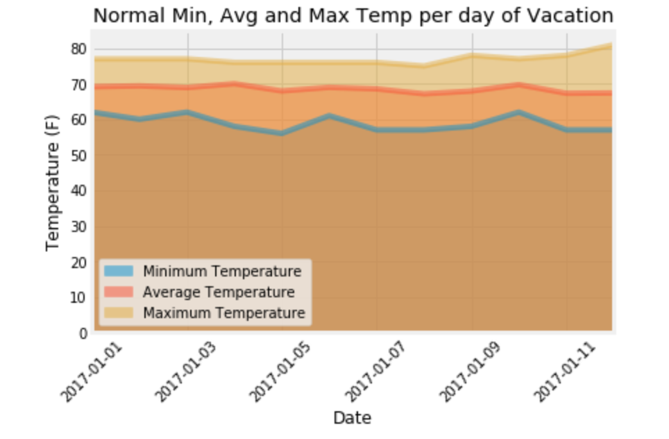

# Climate Analysis Project

In this project we search to answer the question "Is Hawaiian weather truly beautiful year round".

## Connecting to our Database
`Climate.ipynb` uses SQL Alchemy to connect to a SQLite databse and query the weather data for the state of Hawaii. 

## Creating Visualizations 
Several graphs are created using Matplotlib including a stacked area chart. Scipy stats is used to determine if the difference in average temperature between December and June in Hawaii is statistically significant.

## Helping Users Search
`Climate.py` uses Flask and SQL Alchemy to create a web app for users to search through the information gathered from `Climate.ipynb` using an API.
